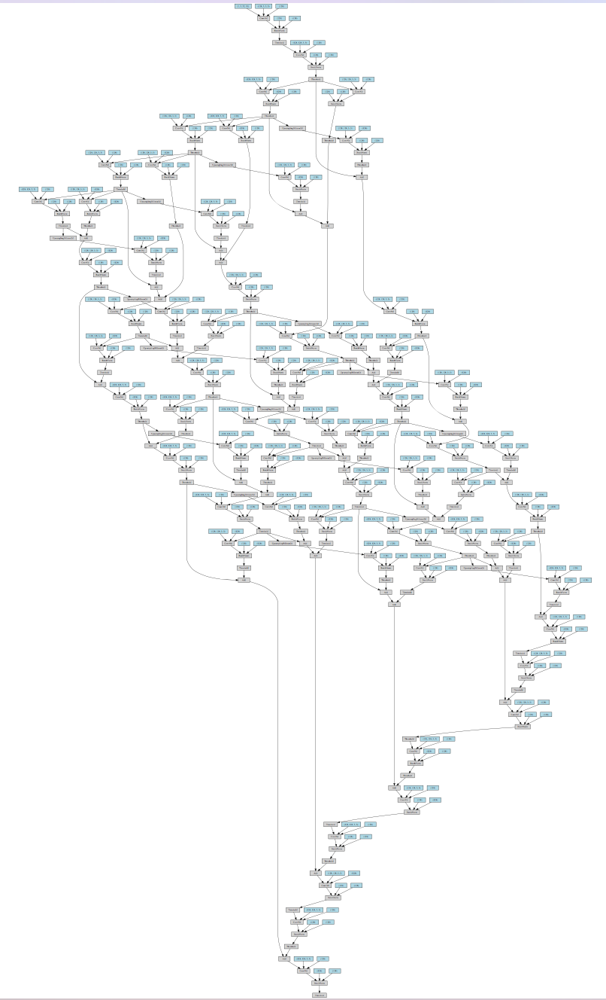

PyTorch implementation of [Convolutinal Neural Fabrics arxiv:1606.02492](http://arxiv.org/abs/1606.02492)
There are some minor differences: 
  - The raw image is first convolved, to obtain #`channels` feature maps.
  - The upsampling is followed by a convolution, and the result is then summed with the other inputs. In the paper, they first sum and then convolve on the result.
  - These can be easily changed in the `UpSample`, `DownSample`, `SameRes` class definitions. Feel free to implement your own procedure and experiment.
  
To run on CIFAR-10:
<pre>
python neural_fabric.py --dataset cifar10 --save fabric_cifar10
</pre>

Test set error: 7.2%, with rotation and translation augmented training data.

